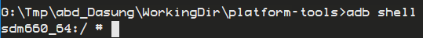

# About
This is an unofficial repo to circulate the firmware updates for Dasung 103
tablet. Dasung tech support does not mind circulating their firmware updates.


Translate:
> Q: Do you guys mind me uploading the firmware to Github?
> A: We don't mind.

## Update (Version 3.0.13.210705)
Change Log:
* Fix the unexpected power-on issue when Bluetooth is kept active.
> Note, this cuts the overnight battery drain from 80% to 10% under sleep mode.

### How to update
Depending on your region, Dasung may or may not have pushed their firmware
updates to their server. If the auto-update works, great. If not, read along.
(Note, I have only tested the following procedures with Windowsd 10 machines. I
do not have a spare Dasung 103 tablet to test with macOS machines.)

### First, grab two zip files
It is costly to host files larger than 100MB on Github. Use [this Dropbox link](
https://www.dropbox.com/sh/gmrkazsnogspp6u/AACtYmCKp7hCS5MBVNmLKK8da?dl=0) to
download two zip-files for Version 3.0.13.210705. 
Through the Dropbox link, you can find the following:
* `platform-tools.zip` contains a `adb.exe` file, this is the workhorse shell that
  gets the job done.
* `update.zip` is the payload to be uploaded to the Dasung 103 tablet.


### Then, use `adb` to apply the firmware update
1. Unzip `platform-tools.zip` locally, and launch Command Prompt from the unzipped
   folder.
2. Move/Copy the `update.zip` file to the folder created in step 1. (Otherwise,
   the adb shell cannot find the payload directly.)
3. Connect the Dasung 103 tablet to the computer.
4. Navigate to the folder in step 1 using Command Prompt, and issue the
   following commands one by one
   ```
   adb push update.zip /data/ota_package/
   adb shell
   ```
   Then, carefully paste the following to the newly opened `adb shell`.
   ```
update_engine_client --update --follow --payload=file:///data/ota_package/update.zip --offset=9034 --size=807766351 --headers="FILE_HASH=skZmkigtTTNayzPX7KG64Tbg7+YUairc25GI/96vCXU=
FILE_SIZE=807766351
METADATA_HASH=8fZx8Pn7JRBRbuo6Crp8+PBjfGklBgvlQ6Vx23hCp5o=
METADATA_SIZE=108795
"
   ```
   > Here is what to expect after issuing command `adb shell`:
   > 
5. Wait for the update to finish (around 5-10 minutes)
6. Then, still in the `abd shell`, issue command: `reboot`. 
    (Note, through the abd shell, the `reboot` command is sent to the tablet
    and commands the tablet to restart.)
